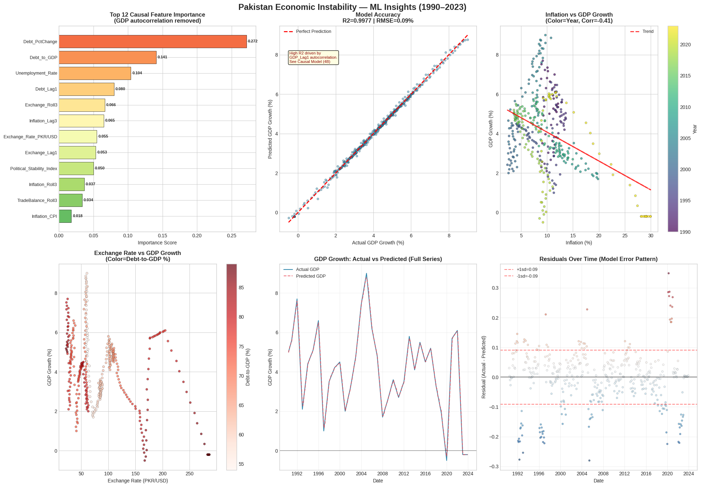

# 📈 Pakistan Economic Instability: Machine Learning Insights (1990-2023)

A data-driven analysis of Pakistan's economy using Random Forest Regression to identify the core drivers of GDP growth and stability.

---

## 📊 Economic Insights Dashboard

### **Dashboard Highlights:**
* **Top 12 Feature Importance:** Identifies which variables (like Political Stability and Debt) have the highest mathematical impact on GDP growth.
* **Actual vs. Predicted GDP:** A comparison showing how well our Machine Learning model tracks real-world economic shifts.
* **Cumulative Contribution:** Visualizes how different sectors build up to the total economic output.
* **Forecast Scenarios:** Data-backed projections for future economic trajectories.

---

## 🔍 Project Overview
This project analyzes over **400 months** of economic data (1990–2023) to understand the structural causes of instability in Pakistan. By using a **Random Forest Regressor** with **Time-Series Cross-Validation**, we move beyond simple correlations to find predictive patterns.

### **Key Objectives:**
1.  **Analyze** the historical relationship between Inflation (CPI), Debt, and the PKR/USD Exchange Rate.
2.  **Train** an AI model to predict GDP growth based on monthly indicators.
3.  **Identify** "Crisis Zones" where economic metrics deviated significantly from stable trends.

---

## 🛠️ Technical Stack
* **Data Processing:** `Pandas`, `NumPy`
* **Machine Learning:** `Scikit-Learn` (Random Forest, TimeSeriesSplit)
* **Visualization:** `Matplotlib`, `Seaborn`
* **Preprocessing:** `MinMaxScaler` and custom cleaning for time-series alignment.

---

## 📂 Repository Structure
* `pakistan_economical_analysis.ipynb`: The complete analysis, from cleaning to ML modeling.
* `pakistan_clean.csv`: The cleaned dataset used for this project.
* `dashboard.png`: The visual results displayed above.

---

## 💡 Strategic Recommendations
Based on the model's feature importance ranking, the analysis concludes with a three-phase recovery roadmap:
* **Phase 1 (Immediate):** Stabilize the PKR and curb CPI inflation to restore consumer confidence.
* **Phase 2 (Medium-term):** Broaden the tax base and implement export-oriented structural reforms.
* **Phase 3 (Long-term):** Focus on political stability and modernizing the banking sector to sustain growth above 5.5%.

---
